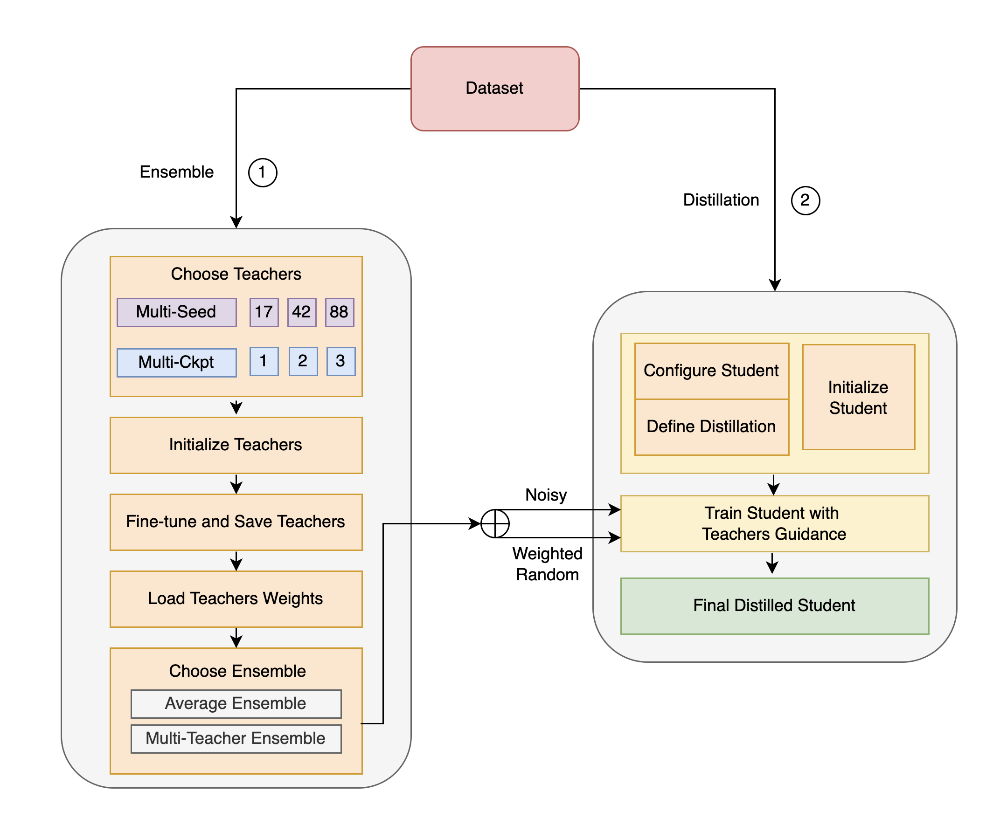

# SEAD

##### **Simple Ensemble And Knowledge Distillation Framework For Natural Language Understanding**

###### 

*SEAD WorkFlow: Left: Ensemble Knowledge from multiple teachers, and we allow multi-checkpoint and multi-seed settings Right: Distillation from the ensemble knowledge with blending techniques and implementation strategies.*

## Update
- [x] **2021.12.31** Add License that provides permission to reuse proprietary software